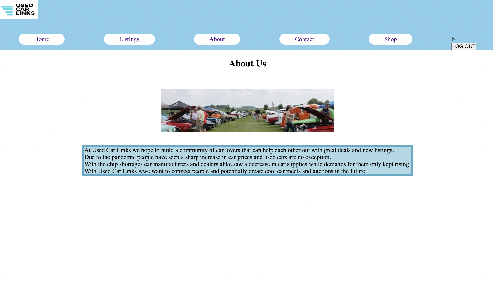
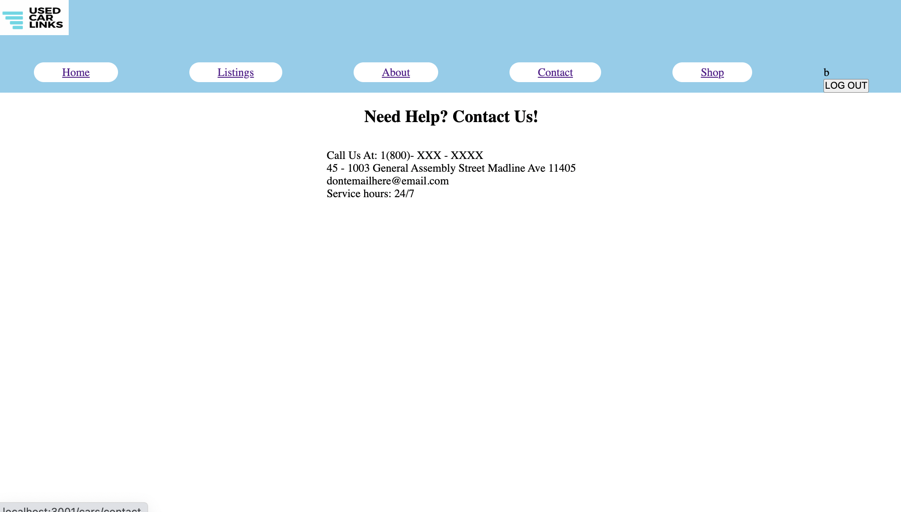

<h1>Technologies used:</h1>
<li>Javascript</li>
<li>Css</li>
<li>Express</li>
<li>Bcrypt</li>
<li>Mongoose</li>
<li>Node</li>
<li>MongoDB</li>
<li>React</li>

The site I decide to create was based on used car websites and sort of a facebook marketplace. The objective of this site is to connect car enthusiasts all around the world with used car listings and meetups for users. As we all know due to the chip shortages finding the right car ove the past months have been quite difficult and although there are sites with similar functions this site will be targeting people more knowledgable with cars and linknig them to people who may not know so much about what a good deal may be. There may be people trying to upload their own listings and pass off an absurd deal for a "great deal", but that is why in the future I want to implement a comment section so that these listings can be critiqued and checked by others. 

When first brought to the site users will be asked to sign in or sign up

Once in the home page will have a short summary and listings

The listing page will have all the listings

The about page will tell users a little bit about ourselves

The contact page is for any questions

The Shop will have a list of our products

From the Shop you can click to move to your shopping cart

